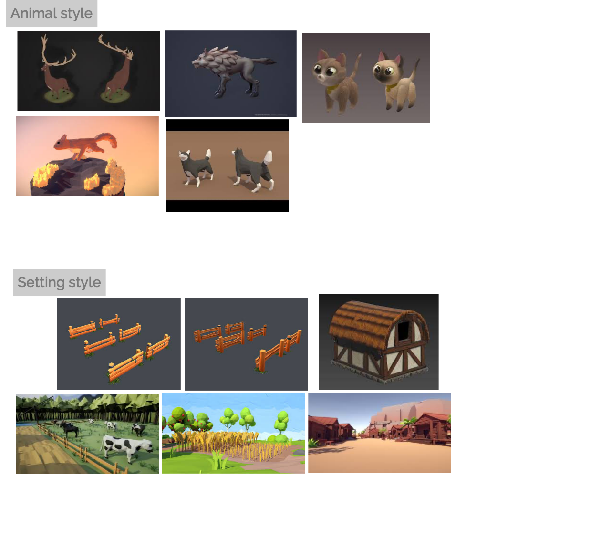

# TITLE: UNTITLED GOAT GAME

### Perspective: 
	First Person

### Style:
	Low Poly, Fantasy, Bold colors, maybe cell shading.
	
	
### Mechanics:
	* Build a fantasy goat part by part, chosen from a goat part ui.
	* Parts List:
		* Horns
		* Ears
		* Tail
	 	* Beards
	 	* others
	* The right combination of parts triggers a combo splash animation and unlocks a new part.
	
	* Once the player has a goat they like they can release their goat to roam an open world.
	
	* The player can vist the open world at anytime from the main menu.
	
	* The player can summon their goats from anywhere to their current location in the world.
	
	* The goats use boids to simulate flocking.	 

	* The player can "push" or "pull" the goat flock.

### Game start:
	* The Player loads into a main menu
	* Main Menu Selctions:
		* Build Goat
	 	* Goat World
	 	* Options
	 	* Credits

	
### Main Game Loop:
	* build Goat
	* release Goat into players world
	* build more Goats
	* visit world and free play with goats
	
### Inner Game loop:
	* pick goat parts to add to goat
	* combination of parts triggers new part unlock
	* new part is added to builder menu
	* use new part to form new combination that may unlock a new part
	* repeat until player likes their goat
	* player saves goat into open world
	
